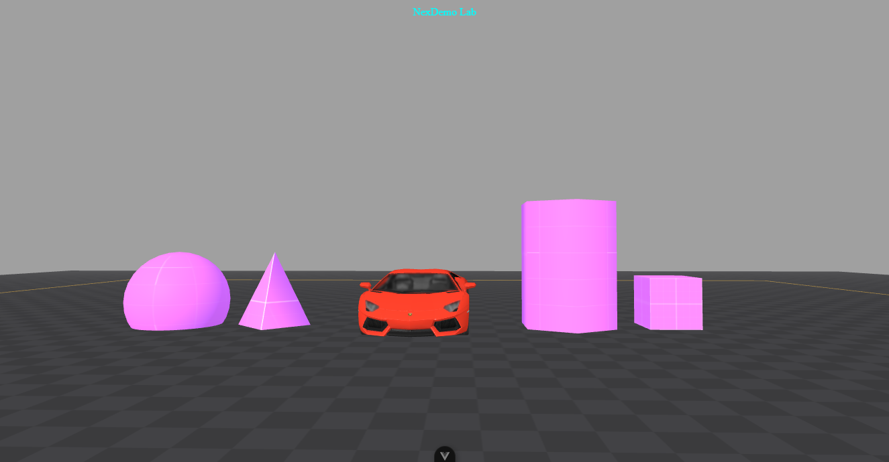

# threejs-demo-lab



> A lab of interactive demos built with Three.js and WebGL.

---

## ✨ Features

- Import 3D Model
- Fog and lights (Directional, Ambient, Hemisphere)
- Example code for planes, cubes, cones, cylinders, and spheres
- Example textures and materials
- UI elements and lines

---

## 📦 Requirements

- Node.js v16 or later
- Recommended IDE Setup: [VSCode](https://code.visualstudio.com/) + [Volar](https://marketplace.visualstudio.com/items?itemName=Vue.volar) (disable Vetur).
- For customization, see the [Vite configuration reference](https://vite.dev/config/).

---

## Project Setup

```sh
npm install
```

### Compile and Hot-Reload for Development

```sh
npm run dev
```

### Compile and Minify for Production

```sh
npm run build
```

---

## 🤝 Contributing

We ❤️ contributions! Follow these steps to contribute:

1. 🍴 **Fork** the repository
2. 🌿 **Create** a new branch (`git checkout -b feature/AmazingFeature`)
3. 💾 **Commit** your changes (`git commit -m 'Add some AmazingFeature'`)
4. 🚀 **Push** to the branch (`git push origin feature/AmazingFeature`)
5. 🔃 **Open a Pull Request**

📖 _See our [Contribution Guidelines](CONTRIBUTING.md) for more details._

---

## 📄 License

This project is licensed under the **MIT License**. See the [LICENSE](LICENSE) file for details.

---

## 📬 Contact & Community

💬 Join us on **Discord**: [Click Here](https://discord.gg/H7pVc9aUK2)  
🐦 **Follow on Twitter**: [@nexoscreator](https://twitter.com/nexoscreator)  
📧 **Email**: [contact@nexoscreator.tech](mailto:contact@nexoscreator.tech)

If you find this project helpful, please consider **starring ⭐ the repository** or **sponsoring 💖 on GitHub**!

<p align="center">
  Created with ❤️ by <a href="https://github.com/nexoscreator">@nexoscreator</a>
</p>